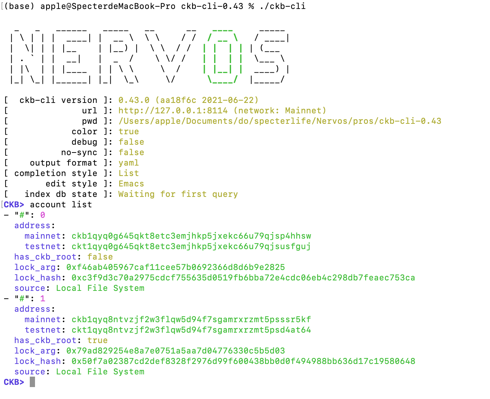

# Task1

## account list in ckb-cli

## Link to the Layer 1 address

[ckt1qyq8ntvzjf2w3flqw5d94f7sgamrxrzmt5psd4at64](https://explorer.nervos.org/aggron/address/ckt1qyq8ntvzjf2w3flqw5d94f7sgamrxrzmt5psd4at64)：https://explorer.nervos.org/aggron/address/ckt1qyq8ntvzjf2w3flqw5d94f7sgamrxrzmt5psd4at64

## Submitted a deposit to Layer 2

