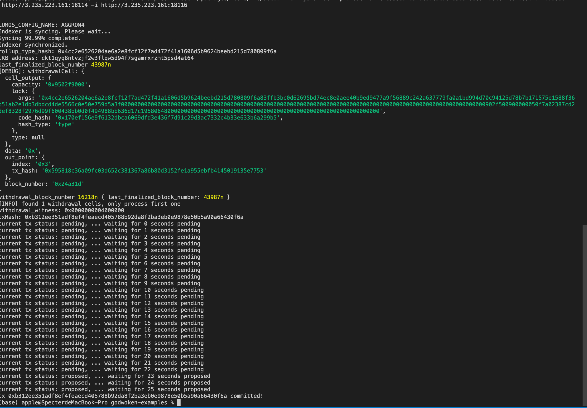

# Task10
## A screenshot of the console output immediately after running the "unlock" command.

## The Ethereum address that you've used for your Layer 2 account .

0x4cCb15C6F2c5645FA1412d7f5038c9EBB272C521

## The Nervos Layer 1 address associated with the private key passed to "unlock" command (in text format). This is "ckb address" in the console output.

ckt1qyq8ntvzjf2w3flqw5d94f7sgamrxrzmt5psd4at64