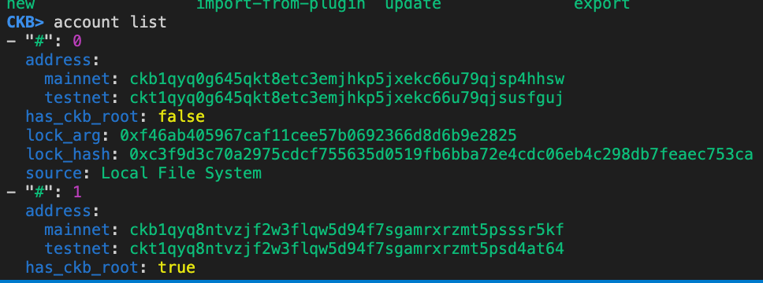
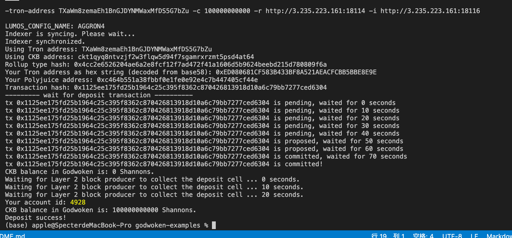
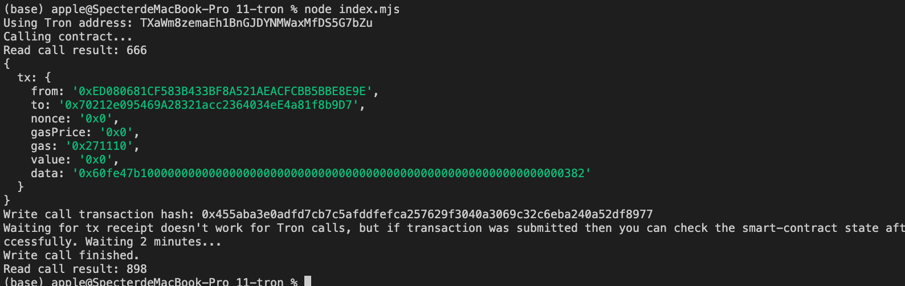

# Task11

## A screenshot of the accounts you created (`account list`) in `ckb-cli`.



## A link to the Layer 1 address you funded on the [Testnet Explorer](https://explorer.nervos.org/aggron/).

https://explorer.nervos.org/aggron/address/ckt1qyq0g645qkt8etc3emjhkp5jxekc66u79qjsusfguj

## A screenshot of the console output immediately after you have successfully submitted a CKByte deposit to your Tron account on Layer 2.



## A screenshot of the console output immediately after you have successfully issued a smart contract calls on Layer 2.



## The `transaction hash` of the "Contract call" from the console output (in text format).

0x455aba3e0adfd7cb7c5afddfefca257629f3040a3069c32c6eba240a52df8977

## The `contract address` that you called (in text format).

0x70212e095469A28321acc2364034eE4a81f8b9D7

## The ABI for contract you made a call on (in text format).

```
[
  {
    "inputs": [],
    "stateMutability": "payable",
    "type": "constructor"
  },
  {
    "inputs": [
      {
        "internalType": "uint256",
        "name": "x",
        "type": "uint256"
      }
    ],
    "name": "set",
    "outputs": [],
    "stateMutability": "payable",
    "type": "function"
  },
  {
    "inputs": [],
    "name": "get",
    "outputs": [
      {
        "internalType": "uint256",
        "name": "",
        "type": "uint256"
      }
    ],
    "stateMutability": "view",
    "type": "function"
  }
]
```


## Your Tron address (in text format).

TXaWm8zemaEh1BnGJDYNMWaxMfDS5G7bZu
