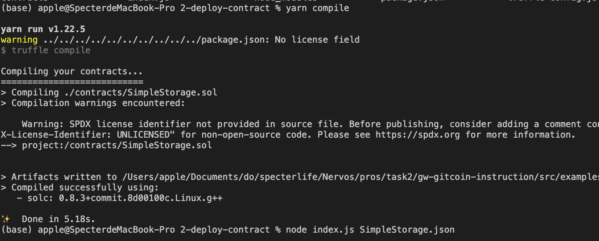

# Task2

##  successfully deployed the smart contract

## Transaction hash

0x8669de7bd5a644ae4830f2d3a9ab864952e62b5dd48459b35a4a150a0d230cc0

## Deployed contract address

0x70212e095469A28321acc2364034eE4a81f8b9D7

