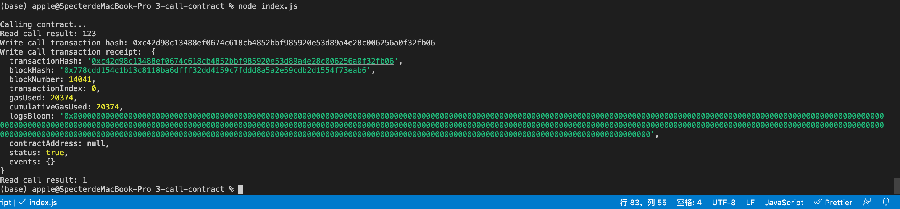

# Task3

# Successfully issued a smart 




## Transaction hash

0xc42d98c13488ef0674c618cb4852bbf985920e53d89a4e28c006256a0f32fb06


## Contract address

0x70212e095469A28321acc2364034eE4a81f8b9D7

## ABI

```javascript
[
    {
      "inputs": [],
      "stateMutability": "payable",
      "type": "constructor"
    },
    {
      "inputs": [
        {
          "internalType": "uint256",
          "name": "x",
          "type": "uint256"
        }
      ],
      "name": "set",
      "outputs": [],
      "stateMutability": "payable",
      "type": "function"
    },
    {
      "inputs": [],
      "name": "get",
      "outputs": [
        {
          "internalType": "uint256",
          "name": "",
          "type": "uint256"
        }
      ],
      "stateMutability": "view",
      "type": "function"
    }
  ]
```


