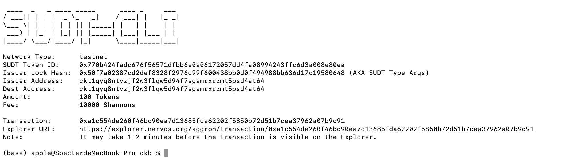
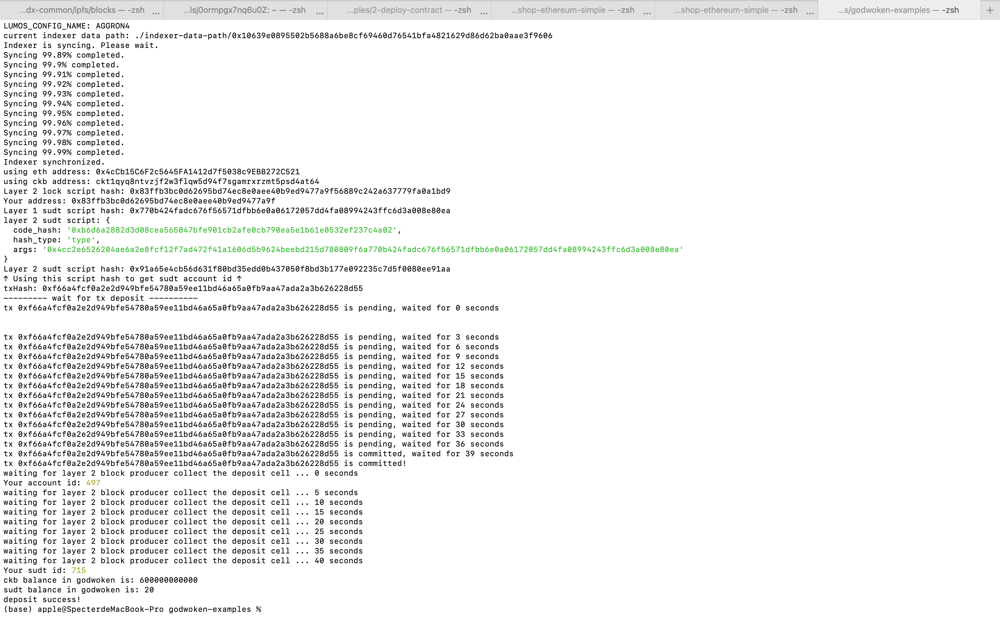

# Task4 

##  link to the Layer 1 address

https://explorer.nervos.org/aggron/address/ckt1qyq8ntvzjf2w3flqw5d94f7sgamrxrzmt5psd4at64

##  Create my SUDT tokens on Layer 1.



## Link to the transaction ID created by `sudt-cli`

https://explorer.nervos.org/aggron/transaction/0xa1c554de260f46bc90ea7d13685fda62202f5850b72d51b7cea37962a07b9c91


## Successfully submitted a deposit to Layer 2 using the `account-cli`



## SUDT ID 

```
715
```

