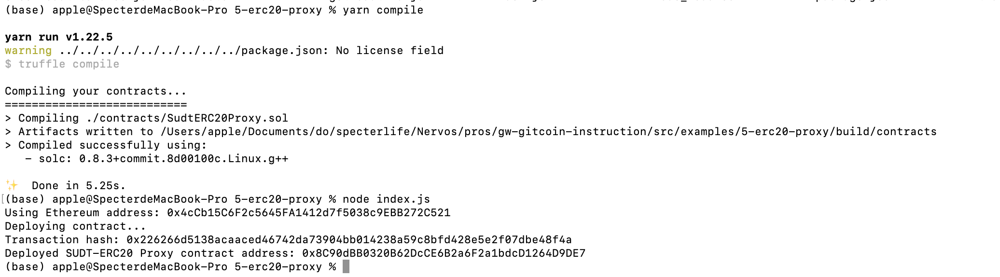
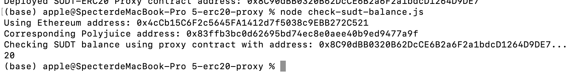

# Task5

## The console output immediately after deploying smart contract




## The address of the ERC20 Proxy Contract

Deployed SUDT-ERC20 Proxy contract address:

 ```
 0x8C90dBB0320B62DcCE6B2a6F2a1bdcD1264D9DE7
 ```

## The console output immediately after checking your SUDT balance




## The Ethereum address that was checked 
```
0x4cCb15C6F2c5645FA1412d7f5038c9EBB272C521
```
