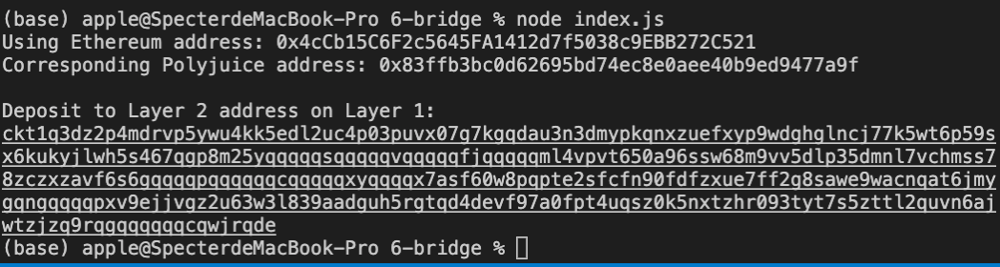

# Task6

## Successfully generated the Deposit Receiver Address



## Deposit Receiver Address

ckt1q3dz2p4mdrvp5ywu4kk5edl2uc4p03puvx07g7kgqdau3n3dmypkqnxzuefxyp9wdghglncj77k5wt6p59sx6kukyjlwh5s467qgp8m25yqqqqqsqqqqqvqqqqqfjqqqqqml4vpvt650a96ssw68m9vv5dlp35dmnl7vchmss78zczxzavf6s6gqqqqpqqqqqqcqqqqqxyqqqqx7asf60w8pqpte2sfcfn90fdfzxue7ff2g8sawe9wacnqat6jmygqngqqqqpxv9ejjvgz2u63w3l839aadguh5rgtqd4devf97a0fpt4uqsz0k5nxtzhr093tyt7s5zttl2quvn6ajwtzjzq9rqgqqqqqqcqwjrqde

## The Ethereum address used to generate the Deposit Receiver Address 

```
0x4cCb15C6F2c5645FA1412d7f5038c9EBB272C521
```


##  A link to the Etherscan explorer for the successful Force Bridge transaction. This can be found on Force Bridge under History→Succeed

https://rinkeby.etherscan.io/tx/0xb0c76072b00cec2dd4dc34bcee42deeeeb0e20ce474e93edfc938aafe66b8c0e


## A link to the Nervos explorer for the successful Force bridge transaction. This can be found on Force Bridge under History→Succeed

https://explorer.nervos.org/aggron/transaction/0xa471d615e03a396d9b1c498f3bdd3d97898a6e25e8e79f0306bc406db8aa4102