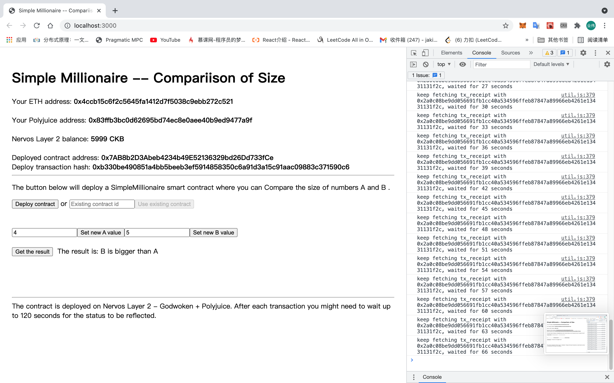

# Task7

## Screenshots or video of  application running on Godwoken



## Link to the GitHub repository with your application which has been ported to Godwoken

https://github.com/Jackieyewang/Nervos-gitcoin/tree/main/nervos-godwoken-dapp


## If you deployed any smart contracts as part of this tutorial, please provide the transaction hash of the deployment transaction, the deployed contract address, and the ABI of the deployed smart contract. (Provide all in text format.)

Deployed contract address: **0x7AB8b2D3Abeb4234b49E52136329bd26Dd733fCe**
Deploy transaction hash: **0xb330be490851a4bb5beeb3ef5914858350c6a91d3a15c91aac09883c371590c6**

ABI of the deployed smart contract:

```
[
    {
      "inputs": [],
      "stateMutability": "payable",
      "type": "constructor"
    },
    {
      "inputs": [
        {
          "internalType": "uint256",
          "name": "x",
          "type": "uint256"
        }
      ],
      "name": "seta",
      "outputs": [],
      "stateMutability": "payable",
      "type": "function"
    },
    {
      "inputs": [
        {
          "internalType": "uint256",
          "name": "y",
          "type": "uint256"
        }
      ],
      "name": "setb",
      "outputs": [],
      "stateMutability": "payable",
      "type": "function"
    },
    {
      "inputs": [
        {
          "internalType": "uint256",
          "name": "x",
          "type": "uint256"
        }
      ],
      "name": "change",
      "outputs": [
        {
          "internalType": "uint256",
          "name": "",
          "type": "uint256"
        }
      ],
      "stateMutability": "pure",
      "type": "function"
    },
    {
      "inputs": [],
      "name": "get",
      "outputs": [
        {
          "internalType": "string",
          "name": "",
          "type": "string"
        }
      ]
```

