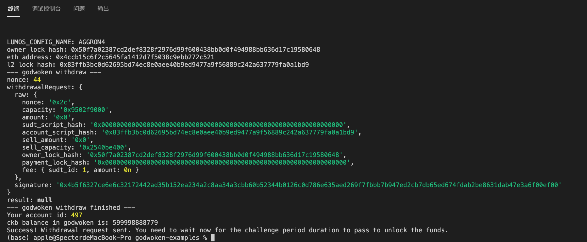

# Task9

## Screenshot of the console output immediately after running the `withdraw` command

## The Ethereum address that you've used for  Layer 2 account 

0x4cCb15C6F2c5645FA1412d7f5038c9EBB272C521

## The Nervos Layer 1 address that you passed to `withdraw` command 

ckt1qyq8ntvzjf2w3flqw5d94f7sgamrxrzmt5psd4at64